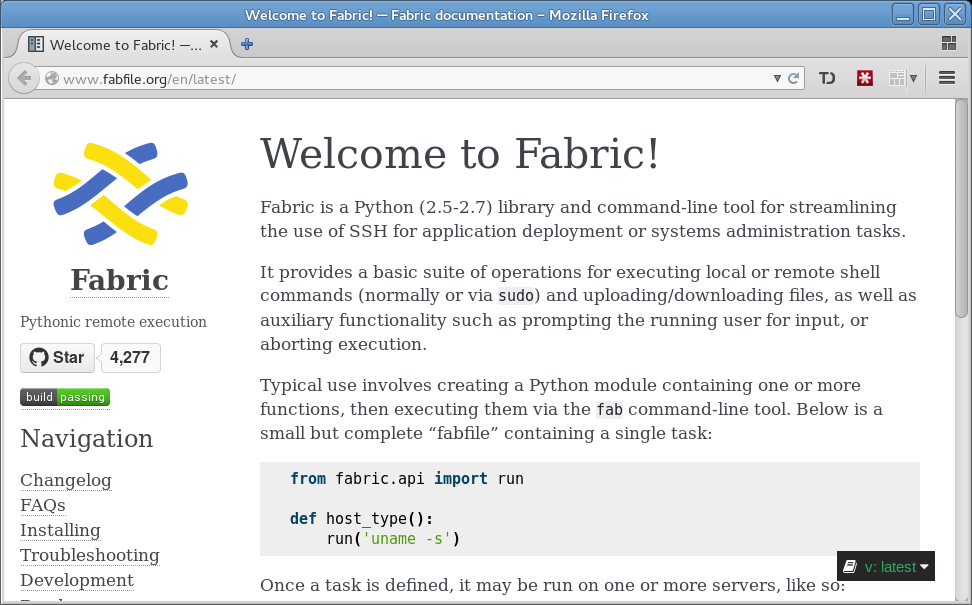

# Fabric for SysAdmins

---

Not this kind of fabric!!

---

This kind of Fabric :)

---

# Running commands on a server

Lets find out what version of RedHat is running on a remote server

    !python
    from fabric.api import *

    @task
    def get_distro_version():
        "Report the distro version of the remote|local system"
        result = run('cat /etc/redhat-release')
        puts(result)

---

# Viewing help

To see what options are avaialable in a fabric script run ``fab -l``.

    !bash
    fab -l
    Available commands:

        get_distro_version  Report the distro version of the remote|local system

---

# Reviewing the output

When we run this against a host we see this.

    !bash
    fab get_distro_version -H bastion-n01
    [bastion-n01] Executing task 'get_distro_version'
    [bastion-n01] run: cat /etc/redhat-release
    [bastion-n01] out: Red Hat Enterprise Linux Server release 6.5 (Santiago)
    [bastion-n01] out: 

    [bastion-n01] Red Hat Enterprise Linux Server release 6.5 (Santiago)

    Done.
    Disconnecting from bastion-n01... done.

---

# What are we solving for

---

# Resources

[Fabric](http://www.fabfile.org/en/latest/) http://www.fabfile.org/en/latest/

[Shellshock](https://shellshocker.net/) https://shellshocker.net/

[Landslide](https://github.com/adamzap/landslide) https://github.com/adamzap/landslide

[This code](https://github.com/ericlake/fabric-shellshock) https://github.com/ericlake/fabric-shellshock

---

# The End

